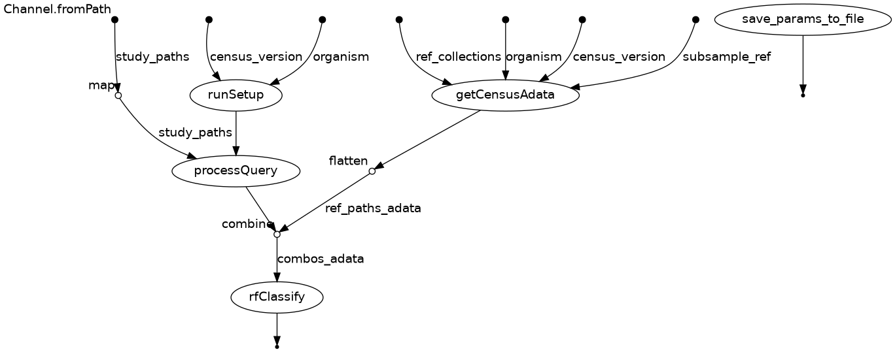

# Nextflow Pipeline for Single-Cell Data Processing and Classification

Nextflow pipeline designed to automatically annotate cell types from single-cell data loaded into the Gemma database. Cell types are assigned using a random forest classifier trained on `scvi` embeddings from the CellxGene data corpus [1][2][3].

## Table of Contents
- [Features](#features)
- [Requirements](#requirements)
- [Installation](#installation)
- [Usage](#usage)
- [Input](#input)
- [Output](#output)
- [Workflow Description](#workflow_description)

---

## Features

- Downloads SCVI models based on organism and census version.
- Processes query datasets using SCVI models.
- Pulls reference datasets from CellxGene census data given an oranism and colletion name.
- Performs cell type classification of query datasets using a random forest model.
- Saves runtime parameters and outputs in a specified directory.

---

## Requirements

- **Nextflow** (=24.10.0)
- **Conda** (for environment management)
- My own conda environments are currently hard-coded into the pipeline (I will set up singularity environments in the future)
---


## Installation

1. Clone this repository:
   ```bash
   git clone https://github.com/rachadele/cell_annotation_cortex.git

## Usage 

The pipeline can be run with the following options:

```
nextflow run main.nf -profile conda \
  --organism <organism_name> \
  --census_version <version> \
  --outdir <output_directory> \
  --studies_dir <path_to_studies> \
  --subsample_ref <subsample_per_cell_type> \
  --ref_collections <list_of_collections> \
  --seed <random_seed> \
  --cutoff <classification_probability_cutoff>
```

Default parameters are as follows:

```
nextflow run main.nf -profile conda \
  --organism mus_musculus \
  --census_version 2024-07-01 \
  --outdir <organism>_subsample_ref_<subsample_ref> \
  --studies_dir /space/scratch/gemma-single-cell-data-ensembl-id/ \
  --subsample_ref 50 \
  --ref_collections ["A taxonomy of transcriptomic cell types across the isocortex and hippocampal formation"] \
  --seed 42 \
  --cutoff 0
```

To run with defaults, simply run:

```
nextflow run main.nf -profile conda
```

NExtflow parameters begin with `-` (e.g. `-profile`; pipeline-specific parameters can be changed on the CLI with `--`).

To resume from the last completed step after an error, run:

```
nextflow run main.nf -profile conda -resume
```

Please note that to change the organism (must be one of `homo_sapiens` or `mus_musculus`), you should also change `--ref_collections` to:

```
"Transcriptomic cytoarchitecture reveals principles of human neocortex organization" \
"SEA-AD: Seattle Alzheimer’s Disease Brain Cell Atlas"
```

(or one of the two). You can also change these parameters directly in `nextflow.config`, e.g.:

```
params.organism = "homo_sapiens"
params.ref_collections = ["Transcriptomic cytoarchitecture reveals principles of human neocortex organization", "SEA-AD: Seattle Alzheimer’s Disease Brain Cell Atlas"]
```

## Input

Input single-cell data should be dumped from Gemma in MEX format with ENSEMBL ids like so (replacing `GSE198014` with your desired experiment ID):

```
gemma-cli-sc getSingleCellDataMatrix -e GSE198014 --format mex --scale-type count --use-ensembl-ids -o /space/scratch/gemma-single-cell-data-ensembl-id/GSE198014
```

I am working on incorporating this into the pipeline. Do this as many times as you'd like for single-cell datasets, and collect them into a parent directory (e.g. `/space/scratch/gemma-single-cell-data-ensembl-id/`). Be sure to check which organism the data comes from. 

As of right now, experimental factors such as tissue or batch are not incorporated into the label transfer. The sample accession (i.e. each set of .mex files) is taken as the `batch_key` for the `scvi` forward pass.


### Parameters


| Parameter          | Description                                                                                  
|--------------------|----------------------------------------------------------------------------------------------
| `organism`         | The species being analyzed (one of `homo_sapiens`, `mus_musculus`).                                         
| `census_version`   | The version of the single-cell census to use (do not change from default)                                                
| `outdir`           | Directory where output files will be saved.                                                  
| `studies_dir`      | Path to the directory containing the input single-cell query datasets.                       
| `subsample_ref`    | Number of cells per cell type to subsample in reference.                                     
| `ref_collections`  | A space-separated list of quoted reference collection names to use for annotation.                  
| `seed`             | Random seed for reproducibility of subsampling and processing.                                
| `cutoff`           | Minimum confidence score for assigning a cell type during classification (default = 0).                     

See [Usage](#usage) for for default parameters.

## Output

For each run, an output directory with the following structure will be written:

```
├── mus_musculus_subsample_ref_50
│   ├── GSE198014
│   │   └── GSE198014_predicted_celltype.tsv
│   └── params.txt
```

one `params.txt` file stores parameters for cell type classification tasks on all of the given studies (e.g. GSE198014)

## Workflow Description




   
## References

1. Lim N., et al., Curation of over 10,000 transcriptomic studies to enable data reuse. Database, 2021. 
2. CZI Single-Cell Biology Program, Shibla Abdulla, Brian Aevermann, Pedro Assis, Seve Badajoz, Sidney M. Bell, Emanuele Bezzi, et al. “CZ CELL×GENE Discover: A Single-Cell Data Platform for Scalable Exploration, Analysis and Modeling of Aggregated Data,” November 2, 2023. https://doi.org/10.1101/2023.10.30.563174.
3. Lopez, Romain, Jeffrey Regier, Michael B. Cole, Michael I. Jordan, and Nir Yosef. “Deep Generative Modeling for Single-Cell Transcriptomics.” Nature Methods 15, no. 12 (December 2018): 1053–58. https://doi.org/10.1038/s41592-018-0229-2.